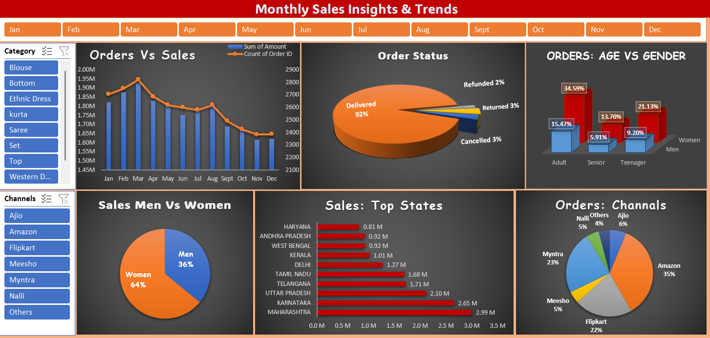

# 📊 Store Data Dashboard – Overview

## 📘 Project Overview

This project is an **interactive Excel dashboard** designed to analyze **store sales** and **order distribution**. It leverages **Pivot Tables, Charts, and Slicers** to provide actionable insights in a visually appealing format.

---

## 📈 Features

- **Dynamic Charts & Visuals** – Track revenue, orders, and category-wise performance
- **Pivot Tables & Slicers** – Filter data by product, region, and time period
- **Sales Performance Analysis** – Compare planned vs. actual revenue/orders
- **Clean & Interactive Layout** – Easy-to-use dashboard for stakeholders

---

## 🛠 Tools & Technologies

- Microsoft Excel (`.xlsx`)
- Pivot Tables & Pivot Charts
- Interactive Slicers
- Conditional Formatting
- Basic Excel Formulas

---

## 📂 Project Files

| File/Folder               | Description                                 |
|---------------------------|---------------------------------------------|
| `Store Data Analysis.xlsx`| Main Excel file with dashboard & data       |
| `screenshots/`            | Folder containing dashboard screenshots     |

---

## 📸 Screenshots

### Dashboard View

---

## 📉 Key Insights

- **Top-performing regions and products** highlighted for decision-making
- **Revenue and order trends** tracked across time for forecasting
- **Segmented visual insights** using filters and slicers

---

## 🧾 How to Use

1. Download the `Store Data Analysis.xlsx` file.
2. Open it using **Microsoft Excel 2016 or later**.
3. Use the slicers and dropdowns to interact with the data.
4. Navigate the charts and tables for insights.

---

## 💼 About This Project

This project demonstrates Excel data analysis and visualization skills:
- Importing and cleaning raw data
- Building dynamic dashboards
- Creating insights for stakeholders
